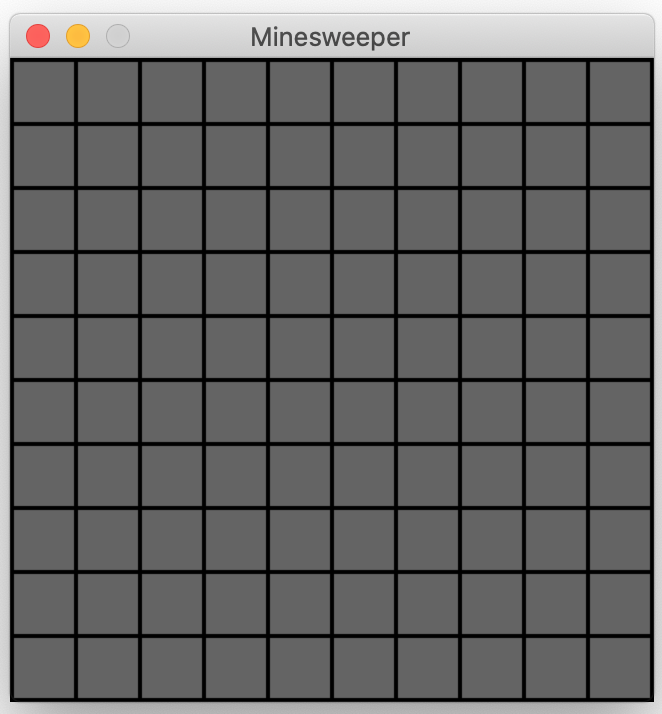

# minefield
Minefield - a minesweeper clone built with [pygame](https://www.pygame.org/wiki/about).

<div style="flex">


</div>

## installation
``` bash
git clone https://github.com/fairclothjm/minefield.git
```
``` bash
paver setup
```

## play
``` bash
paver run
```


